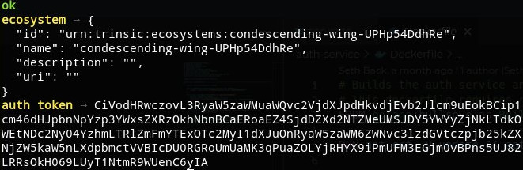

The concept of an ecosystem in Trinsic encompases all aspects of the issuer, holder, and verifier triangle. This includes:

* Governance Frameworks: who is allowed to issue and verify credentials
* Credential Templates: a library of definitions that can be used to easily issue credentials
* Credentials and Revocation Registries: actual issued credentials and their revocation status
* Wallets: secure location for users to store their credentials

Think of an ecosystem as a network of participants that can authenticate to and share data with one another and the outside world.

Great! Let's create a custom ecosystem now:

`trinsic provider create-ecosystem`{{execute}}

You should see output similar to:

This provisioned a unique ecosystem on Trinsic's platform and returned an authentication token you can use to interact with it.

You may have noticed the ID is a little funny, something like `helpful-marmot-a9082bUdb` or `condescending-beaver-Os9024nsi`. This is a full featured demo ecosystem that you can interact with, issue credentials in, and experienc all of Trincic's features. It isn't permanent though, and will be deleted.